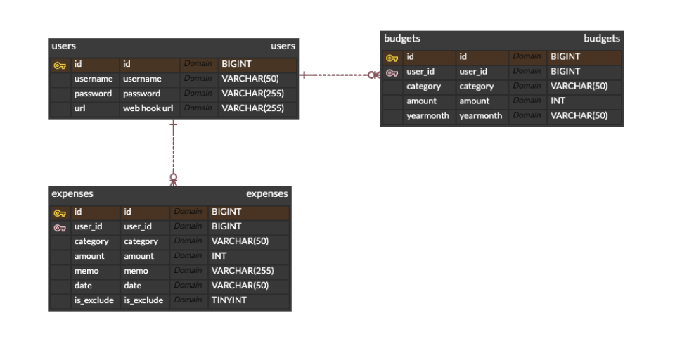
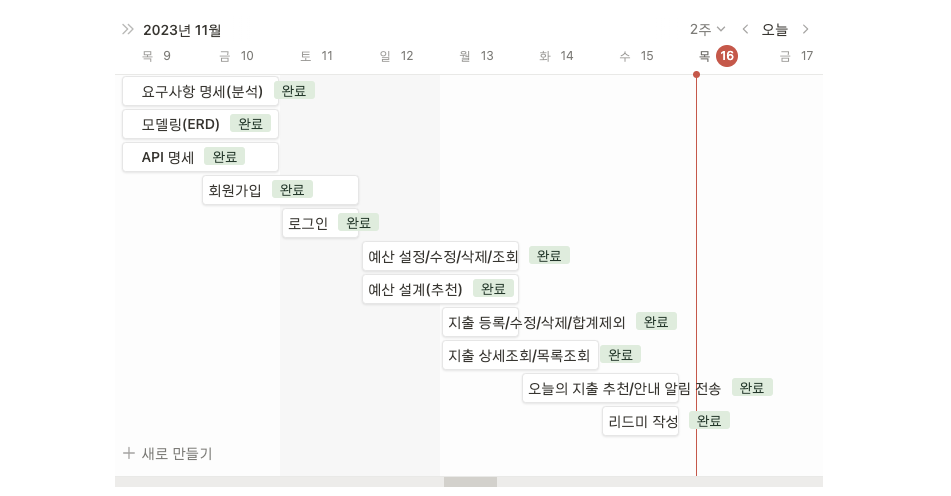

## 프로젝트 개요
> 본 서비스는 사용자들이 개인 재무를 체계적으로 관리하고 지출을 추적하는 데 도움을 주는 통합적인 서비스입니다.
> 이 앱은 사용자들이 예산을 세부적으로 계획하고 지출 내역을 효과적으로 관리하여 재무 목표를 성취하는 데 도움이 됩니다.
> 사용자들은 개인화된 알림을 통해 재무 상태를 실시간으로 파악하고, 다른 사용자들의 통계 데이터를 활용하여 예산을 설정하는 데 도움을 받을 수 있습니다.

<br/>

## 개발환경
```
• IDE : IntelliJ IDEA Ultimate
• 언어 : Java 17
• 프레임워크 : Spring Boot 3.1.5
• 빌드 도구 : Gradle
• 데이터베이스 : MySQL 8.0
```

</a>
</a>
</a>
</a>
</a>
</a>
</a>
</a>
</a>
</a>
</a>
</a>

<br/>

## 주요기능
> [요구사항 명세](https://docs.google.com/document/d/1H4a39PAr1TMuukR_pjNocQ8biqfBOcN10ddVE90MXqo/edit#heading=h.846n0chsqbqx)

### ⚙️ 예산 설정 및 설정 도우미
- 사용자는 각 카테고리에 대한 월별 예산을 설정하고 수정, 삭제, 조회 할 수 있습니다.
- 사용자는 카테고리 별 예산을 설정하는 데 도움을 받을 수 있습니다.

### 🧾 지출 내역
- 사용자는 지출을 등록하고 수정, 삭제, 조회 할 수 있습니다.
- 사용자는 지출 내역을 지출 합계에서 제외 할 수 있습니다.

### 💡 지출 컨설팅
- 월별 설정한 예산을 기준으로 일일 소비 가능 금액을 제공하여 예산을 효율적으로 관리할 수 있습니다.
- 오늘 발생한 지출 내역을 제공하여 사용자는 어떤 카테고리에 얼마나 지출했는지 확인할 수 있습니다.
- 소비 가능한 금액을 초과한 경우 사용자에게 경고를 제공하여 사용자는 지출에 주의를 기울일 수 있습니다.

<br/>

## ERD (모델링)


<br/>

## API 명세
#### 사용자

| Action | Verbs  | URL Pattern |
|:------:|--------|:-----------:|
|  회원가입  | POST   |    /join    |
|  로그인   | POST   |   /login    |

#### 카테고리
|   Action   | Verbs | URL Pattern |
|:----------:|:-----:|:-----------:|
| 카테고리 목록 조회 |  GET  | /categories |


#### 예산 관리
|  Action   | Verbs  | URL Pattern   |
|:---------:|:------:|---------------|
|   예산 설정   |  POST  | /budgets      |
|   예산 수정   |  PUT   | /budgets/{id} |
|   예산 삭제   | DELETE | /budgets/{id} |
|   예산 조회   |  GET   | /budgets      |
| 예산 설계(추천) |  GET   | /budgets/rec  |

#### 지출 관리
|  Action  | Verbs  | URL Pattern    |
|:--------:|:------:|----------------|
|  지출 등록   |  POST  | /expenses      |
|  지출 수정   |  PUT   | /expenses/{id} |
| 지출 합계 제외 | PATCH  | /expenses/{id} |
|  지출 삭제   | DELETE | /expenses/{id} |
| 지출 상세 조회 |  GET   | /expenses/{id} |
| 지출 목록 조회 |  GET   | /expenses      |


### 🔔 오늘 지출 추천 & 안내 디스코드 알림
(사진 첨부 예정)

<br/>

## 이슈 및 해결


<br/>

---

### 타임라인
